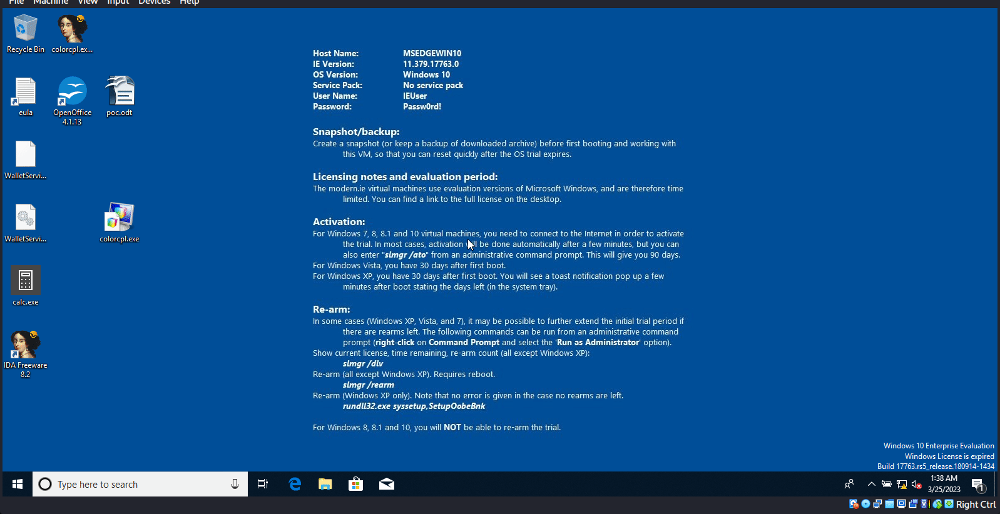

# CVE-2022-47502
 - Macro URL arbitrary script execution without warning 

## refs
 - https://cve.mitre.org/cgi-bin/cvename.cgi?name=CVE-2022-47502
 - https://www.openoffice.org/security/cves/CVE-2022-47502.html

## details
 
While doing variant analysis between libreoffice and openoffice codebases, i
found a poc on twitter for a CVE of libreoffice which turned out to be a oday
on openoffice (thank you friend for the free cve). And so i reported the
vulnerability and after inspecting the patch i concluded that, while
libreoffice and openoffice codebases are similar, the uri schema part was different.

### poc 

